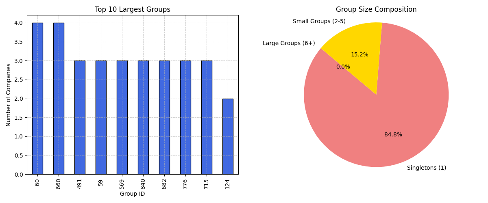
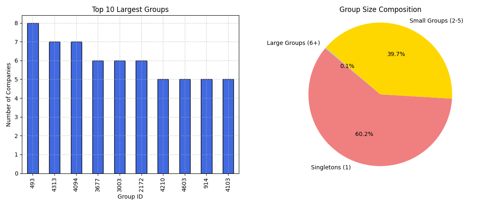
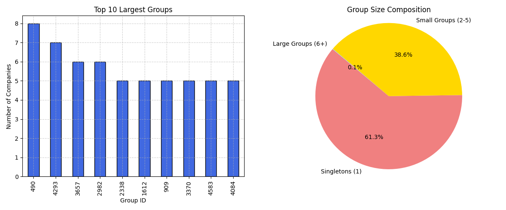

# Entity Resolution Project

## Overview

The project aims to identify and correctly group duplicate records of companies within a large dataset. The main idea
behind its solution is to detect and cluster data entries that are likely to refer to the same entity, giving slight
variations in data.

### 1. Data preprocessing

The first aspect that was taken into consideration was inspecting and refining the dataset. This meant inspecting
multiple entries and identifying potential faults. This resulted in a series of rules that had to be applied:

- Filling non-existent `company_name` by using the first value of `company_legal_names`. If that is not available, the
  first value of `company_commercial_names` is to be used instead.
- In case address information from `main_address_raw_text` is not available, `main_street` is to be used instead.
- Extracting the first value of the `domain` data, where multiple values existed.
- Removed common company suffixes (e.g., "LLC", "Inc")
- Standardized country names with the help of `pycountry` package and `main_country_code`
- Removed special characters
- Replaced all other missing values `\N` with `None` in order to align with Python standards

### 2. Similarity Calculation

One of the first encountered problems was how to identify and better distinguish records that are similar. When
inspecting the data manually, I noticed some records that seemed to refer to the same company, but they were not
completely the same, therefore the challenge consisted in comparing companies that might be written in a slightly
different way across the data entries, as long as some minor discrepancies regarding typos, formatting or abbreviations.
After careful consideration and some research, the `rapidfuzz` library was found as a great solution that could solve
this issue by generating a score of similarity between relevant data.

After being set on that library, I decided that not all the fields are relevant when trying to identify duplicate
records or some of them were mostly missing across records. On that matter, the chosen key fields that have the most
potential to represent a company's identity are `company_name`, `main_address_raw_text` and `domains`. However, even so
I decided that these three do not have the same level of importance and when considering an overall score for a specific
company record, a weighted similarity score is computed following this formula:

```python
# Weighted similarity = (0.6 * Name Similarity) + (0.2 * Address Similarity) + (0.1 * Domain Similarity)
```

- 60% for the name of the company due to it being the most relevant and critical identifier, but not enough due to
  companies that have different names despite being the same entity
- 20% for the address in order to find companies that have similar names but operate in different locations (not as
  reliable as the name giving problems with formatting)
- 10% for the domain giving that it should be unique (not as reliable as the name giving the fact that it is missing for
  quite a few companies)

After using `token_sort_ratio` and `token_set_ratio` from the `rapidfuzz` library accordingly, depending on the field in
order to compute the similarity score by comparing sets of records, each entry has a general similarity score that we
are going to use later in order to cluster them together and provide structured, interpretable features for the models.

Even though this step was fairly successful and easy to achieve, it took an enormous amount of time for it to be
executed due to the very large number of comparisons that had to be made. Thus, I decided to use a blocking strategy by
grouping and comparing only companies within the same country. This drastically reduced the execution time and made the
first visible results possible.

### 3. Clustering the data

This step involved finding the best way that could both group and categorize the data based on the similarity scores.
After doing some research, I thought I could tackle this by trying different algorithms and hopefully finding out if one
generates a more accurate solution or not.

### Rule-based clustering

Starting with the simplest approach, this method implies comparing the similarity scores with a fixed threshold in order
to establish if two companies are duplicates or not. Following that, if two companies have a `weighted_similarity_score`
greater than the threshold they can be considered as potential matches. This makes the results easy to interpret, but
during testing it was found that it is really sensitive to the chosen threshold. If it is too high, then it risks to
miss duplicates and if it is too low the data contains plenty of false positives.

### XGBoost clustering

In order to search for more accurate results, machine learning algorithms have been taken into consideration. The first
one being XGBoost, a great option for classification tasks, optimized for speed by using parallelized tree construction
and cache optimization. It follows a simple core principle by initializing a base prediction and then creating a new
tree at each step, every time correcting the errors from the previous prediction, reducing the error progressively. With
all these information in mind, we can now understand why this could be a good fit for helping to find duplicate records
with greater precision.

This time, instead of manually setting thresholds, the model gets trained in order to better understand what a duplicate
really is. The process starts with generating the pseudo-labels (`1` if the `weighted_similarity >= THRESHOLD`, or `0`
otherwise) in order to train the classifier. Then, the model is able to learn patterns across multiple chosen
features (`name_similarity`,`address_similarity`,`website_similarity`,`weighted_similarity`) and following with the
prediction of duplicate values that can be then converted into clusters.

After executing the pipeline for the first time, it was discovered that the data was imbalanced due to having a large
number of unique company records. This was handled by using the `scaled_pos_weight` parameter and calculating how much
more common the negative class is, compared to the positive one. In this way, the model can give more importance to the
minority class.

The first computed results meant that now we could do a comparison with the initial rule-based option. The new results
indicate a much lower false-positive occurrence as well as a much smaller 'largest' group. However, one notable aspect
is that the largest cluster found by the XGBoost algorithm contained company records that were clearly not well
categorized.
This meant that way too many comparisons were being made during the similarity score computing resulting in higher
chance of encountering false-positives. Therefore, a new blocking aspect was implemented by also grouping the records
based on the city where each company is based in. This showed clear results by drastically reducing the similarity
computing time as well as reducing the number of false positives to basically non-existent.

### Random Forest clustering

The XGBoost clustering has proven itself to be definitely better than the initial clustering idea, but in order to
determine if it was actually accurate, I decided to also try the Random Forest classifier and compare the results. It
shares many similarities with XGBoost, predicting duplicate pairs based on the similarity features and having the same
input. This time, the model uses multiple decision trees in order to predict if two company records are duplicates. This
one handles imbalanced datasets quite well, is less sensitive than XGBoost, but might not capture very subtle patterns
as well, and it is also considerably slower. The results are definitely similar between the two with minor differences
in terms of the actual grouping and uniquely identifying distinct companies, and for that matter, due to XGBoost being
noticeably faster and greater for scaling, it can be considered the superior option.

All three models have in common the use of the `NetworkX` library. By using it, an undirected graph was created where
each node represents a company and each edge represents a similarity link between two companies. Then we can simply get
the clusters containing similar records by extracting the connected components from the created graph and assign them a
unique group ID. This process can be considered more scalable and flexible than a manual check by letting the graph
structure handle the rules.

### 4. Visualizing results

In order to better understand and interpret the final results, a series of charts gets generated at the end of the
execution.
For each method there is a bar chart that displays the top 10 largest duplicate groups and a pie chart that visualizes
how many companies are distributed across group sizes.

### Rule-based results

By analyzing the first output charts we can tell that the rule-based clustering has the two largest groups with four
companies each, the smallest containing two companies and the others three companies.
Also, most of the records (84.8%) seem to be classified as singletons, meaning that the vast majority of the companies
do not belong to any duplicate record.
However, the small groups occupy 15.2% of the total entries, meaning that there are quite a few that had at least one
duplicate record. There were no large groups identified which isn't a good indicator giving that the probability of
being more than 6 records for the same company in such a large dataset is quite large. Therefore, we can already tell
that this method of clustering the data did not generate accurate results.



### XGBoost results

Now, looking at the XGBoost charts results, the results seem to align more with reality. Now, the biggest group has
eight duplicate records, double than the previous method, and it also identified groups of seven and six companies,
respectively, which were not present at all.
The pie chart suggests quite different results, the number of singletons has been reduced by more than 20%, indicating
much better clustering results and more duplicate records found. The small groups are 24% bigger, while the large groups
are now at 0.1% which might seem like a small value, but giving the size of the dataset, that could mean hundreds of
companies. Overall, a much better result, meaning that the machine-learning model was able to better classify duplicate
records, even though the dataset was exactly the same, but, nonetheless, this was to be expected.



### Random Forest results

When looking at the results generated by the Random Forest model, it is easy to observe the similarity to the XGBoost
method. They both identified the largest group with eight companies, and even their IDs are quite close. However, the
third-largest group created by Random Forest only has six companies, compared to seven grouped by XGBoost.
This aspect needs further inspection, as it might lead to a potential false-positive coming from XGBoost, or a less
aggressive approach by Random Forest, resulting in a false-negative. In terms of the pie chart data, they prove again to
be quite similar, having only a small margin between the percentages.



### Comparison of the top 10 largest groups

In order to get a better grasp of the results, we can take a look at the generated results.
The largest groups are the ones that are most likely to contain false-positives.
By only looking at the first table, we cannot get to any conclusion, the only noticeable thing is that the IDs generated
by the machine learning models are somewhat close, but nothing more.

| Rank | Rule-Based Group ID | Size | XGBoost Group ID | Size | Random Forest Group ID | Size |
|------|---------------------|------|------------------|------|------------------------|------|
| 1    | 60                  | 4    | 493              | 8    | 490                    | 8    |
| 2    | 660                 | 4    | 4313             | 7    | 4293                   | 7    |
| 3    | 491                 | 3    | 4094             | 7    | 3657                   | 6    |
| 4    | 59                  | 3    | 3677             | 6    | 2982                   | 6    |
| 5    | 569                 | 3    | 3003             | 6    | 2338                   | 5    |
| 6    | 840                 | 3    | 2172             | 6    | 1612                   | 5    |
| 7    | 682                 | 3    | 4210             | 5    | 909                    | 5    |
| 8    | 776                 | 3    | 4603             | 5    | 3370                   | 5    |
| 9    | 715                 | 3    | 914              | 5    | 4583                   | 5    |
| 10   | 124                 | 2    | 4103             | 5    | 4084                   | 5    |

By taking a deeper look at the results and grouping them together into the same place, we can tell that all three
methods identified the same company as the one with the most duplicate records.
However, the rule-based method missed some entries, meaning that it is not accurate-enough.

| Company Name           | Rule-Based (Group 60) | XGBoost (Group 493) | Random Forest (Group 490) | Country |
|------------------------|-----------------------|---------------------|---------------------------|---------|
| calgary deck railings  | ✅                     | ✅                   | ✅                         | Canada  |
| glass railings calgary |                       | ✅                   | ✅                         | Canada  |
| calgary deck railing   |                       | ✅                   | ✅                         | Canada  |
| deck railing canada    | ✅                     | ✅                   | ✅                         | Canada  |
| deck railings calgary  | ✅                     | ✅                   | ✅                         | Canada  |
| deck railing calgary   | ✅                     | ✅                   | ✅                         | Canada  |
| calgary glass railings |                       | ✅                   | ✅                         | Canada  |
| calgary glass railing  |                       | ✅                   | ✅                         | Canada  |

When it comes to the second-largest group, the machine-learning models delivered the same result, but the rule-based
method, fails to align with them.
This is not necesarry wrong as this specific company might have been correctly grouped but due to multiple groups having
the exact number of duplicate records.

| Company Name                   | Rule-Based (Group 660) | XGBoost (Group 4313) | Random Forest (Group 4293) | Country       |
|--------------------------------|------------------------|----------------------|----------------------------|---------------|
| northwestern womens basketball |                        | ✅                    | ✅                          | United States |
| northwestern baseball          |                        | ✅                    | ✅                          | United States |
| northwestern mens tennis       |                        | ✅                    | ✅                          | United States |
| northwestern mens golf         |                        | ✅                    | ✅                          | United States |
| northwestern womens golf       |                        | ✅                    | ✅                          | United States |
| northwestern womens tennis     |                        | ✅                    | ✅                          | United States |
| northwestern mens basketball   |                        | ✅                    | ✅                          | United States |
| dr gabriela garciarojas dds    | ✅                      |                      |                            | United States |
| garciarojas gabriela dds       | ✅                      |                      |                            | United States |
| gabriela garciarojas dds inc   | ✅                      |                      |                            | United States |

Inspecting the third place, we can definitely tell that the rule-based model does not align well with the other two.
Moreover, the two machine-learning models are drifting apart as well, as they are not referring to the same company
anymore.

| Company Name                                            | Rule-Based (Group 491) | XGBoost (Group 4094) | Random Forest (Group 3657) | Country       |
|---------------------------------------------------------|------------------------|----------------------|----------------------------|---------------|
| flaherty sensabaugh bonasso pllc                        | ✅                      |                      |                            | United States |
| flaherty sensabaugh  bonasso pllc                       | ✅                      |                      |                            | United States |
| flaherty sensabaugh  bonasso                            | ✅                      |                      |                            | United States |
| jessica cameron  fitzpatrick team re max results        |                        | ✅                    |                            | United States |
| devin sheehan  fitzpatrick team re max results          |                        | ✅                    |                            | United States | 
| caroline leitao  fitzpatrick team at re max results     |                        | ✅                    |                            | United States |
| taylor gildein  fitzpatrick team re max results         |                        | ✅                    |                            | United States |
| laurel handel polselli  fitzpatrick team re max results |                        | ✅                    |                            | United States |
| kaitlyn pimentel  fitzpatrick team re max results       |                        | ✅                    |                            | United States |
| tyler meegan  fitzpatrick team re max results           |                        | ✅                    |                            | United States |
| forest home animal clinic erica peck dvm                |                        |                      | ✅                          | United States |
| forest home animal clinic                               |                        |                      | ✅                          | United States |
| forest home animal clinic james rieser dvm              |                        |                      | ✅                          | United States |
| forest home animal clinic ddc                           |                        |                      | ✅                          | United States |
| forest home animal clinic sc                            |                        |                      | ✅                          | United States |
| forest home animal clinic abha khatter dvm              |                        |                      | ✅                          | United States |

Now by taking a look at the third-largest group from the XGBoost classification, we can try to find the matches in the
Random Forest grouping file.
By doing that we can see that XGBoost tends to form broader clusters, which might be a consequence of the gradient
boosting approach.
This can sometimes over-group similar records if their features are strongly aligned by common keywords.
By comparison, the Random Forest model seems to be more conservative maybe due to subtle variations in address or domain
similarity, leading to smaller and tighter clusters.

| Company Name                                            | XGBoost Group ID | RF Group ID | Country       |
|---------------------------------------------------------|------------------|-------------|---------------|
| jessica cameron  fitzpatrick team re max results        | 4094             | 4074        | United States |
| devin sheehan  fitzpatrick team re max results          | 4094             | -           | United States |
| caroline leitao  fitzpatrick team at re max results     | 4094             | 4074        | United States |
| taylor gildein  fitzpatrick team re max results         | 4094             | -           | United States |
| laurel handel polselli  fitzpatrick team re max results | 4094             | -           | United States |
| kaitlyn pimentel  fitzpatrick team re max results       | 4094             | 4076        | United States |
| tyler meegan  fitzpatrick team re max results           | 4094             | 4076        | United States |

When reversing the analysis, both Random Forest and XGBoost delivered the same results, grouping all six companies into
the same cluster, but with different IDs.
This comes as a suggestion that for highly similar entities, both of them consistently recognize and cluster the
duplicates of highly related records.

| Company Name                               | Group ID (Random Forest) | Group ID (XGBoost) | Country       |
|--------------------------------------------|--------------------------|--------------------|---------------|
| forest home animal clinic erica peck dvm   | 3657                     | 3677               | United States |
| forest home animal clinic                  | 3657                     | 3677               | United States |
| forest home animal clinic james rieser dvm | 3657                     | 3677               | United States |
| forest home animal clinic ddc              | 3657                     | 3677               | -             |
| forest home animal clinic sc               | 3657                     | 3677               | United States |
| forest home animal clinic abha khatter dvm | 3657                     | 3677               | United States |

While taking a look at the previous results, there seems to be a small potential issue. Both models correctly identified
two distinct clusters.
However, the last two records could have been assigned to those groups as well, as they are quite similar to those above
them. This can be solved by tuning the weighted similarity more, increasing the tolerance on name similarity, or adding
additional post-processing for isolated nodes.

| Company Name                                        | Group ID (Random Forest) | Group ID (XGBoost) | Country       |
|-----------------------------------------------------|--------------------------|--------------------|---------------|
| forest home animal clinic erica peck dvm            | 3657                     | 3677               | United States |
| forest home animal clinic                           | 3657                     | 3677               | United States |
| forest home animal clinic james rieser dvm          | 3657                     | 3677               | United States |
| forest home animal clinic ddc                       | 3657                     | 3677               | -             |
| forest home animal clinic sc                        | 3657                     | 3677               | United States |
| forest home animal clinic abha khatter dvm          | 3657                     | 3677               | United States |
| forest home animal clinic doggie day camp  boarding | 3658                     | 3678               | United States |
| forest home animal clinic doggie day camp           | 3658                     | 3678               | United States |

### Conclusions

After analyzing the results generated by all three classification methods, it is certain that the two machine-learning models are more capable in terms of delivering accurate results.
Moreover, out of the two, XGBoost can be considered the superior choice due to more consistent grouping, as evidenced by creating larger, more meaningful clusters.
It also manages to be better at handling the imbalance between singletons and duplicates due to the `scale_pos_parameter` and captures more subtle and complex relationships in similarity scores. 
Furthermore, it is a much faster model, being able to complete the clustering at a much faster pace compared to Random Forest.

### Future improvements

The current solution manages to provide good results, and it definitely solves the problem of correctly grouping similar company records. 
Regardless, there is always room for improvement and here are some aspects that are worth considering for achieving even more accurate results:
- Enhancing the similarity scores by using more complex metrics such as `Jaccard similarity` for the domains or the address geocoding.
- Expanding the blocking strategy in order to account for other fields such as `business_model` or `main_business_category`. This might reduce the computing time even further and also contribute to minimizing the false-positive results.
- Adjusting the weighted similarities in order to explore other results. By giving more importance to other fields, companies that have different names, but are the same entity might be discovered.
- Experimenting with other models such as `LightGBM` or `CatBoost` to compare them with the current `XGBoost`.
- Rethinking the similarity computation and utilizing parallel or distributed processing in order to satisfy future scaling needs.